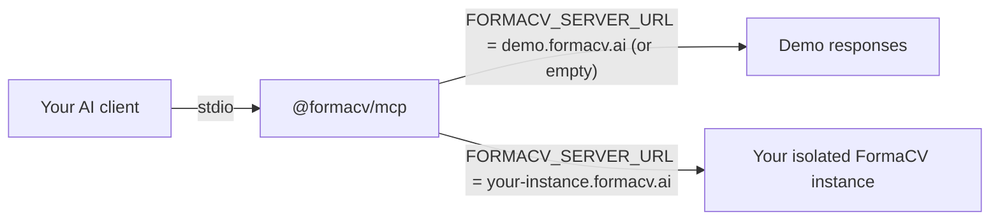

# @formacv/mcp — Official Model Context Protocol server for FormaCV

Drive AI-powered CV formatting, anonymization, AI tailoring, and ATS push-back from Claude Desktop, Cursor, and your own AI agents — using the [Model Context Protocol](https://modelcontextprotocol.io/).

[](https://www.npmjs.com/package/@formacv/mcp)

[](LICENSE)

[](https://formacv.ai)

## What this is

FormaCV gives staffing teams **AI CV formatting** and polished **resume formatting** without bouncing files through manual Word cleanup. Agencies connect their ATS, upload unlimited **branded CV** templates, and deliver client-ready collateral in roughly a minute. The **`@formacv/mcp` MCP server** extends that workflow to whichever **AI agent** stack you prefer: recruiters can orchestrate tailor → anonymize → push-back sequences straight from conversational tools rather than juggling separate tabs.

**Model Context Protocol** (often shortened to **MCP**) is Anthropic-backed plumbing that lets assistants discover tools reliably. Installing this **MCP server** means Claude, Cursor Copilots, or bespoke automation can call eight well-documented primitives — `format_cv`, `tailor_cv`, `anonymize_cv`, `push_to_ats`, plus batching, introspection helpers, and asynchronous job polling — with JSON contracts identical to FormaCV’s HTTPS API.

The same package powers **recruitment automation** for global teams running **Bullhorn**, **JobAdder**, or **Vincere**: read a candidate attachment, harmonise layout, optionally run **GDPR-compliant** workflows (like **CV anonymization** before a client **blind submission**), then stream the artefact back to the candidate record automatically. Keywords your compliance team cares about map to product reality: deterministic audit logs on anonymization flows, configurable retention, AES-256 at rest / TLS in motion, isolated infrastructure per tenant, optional on-premises deployment — all surfaced on **[FormaCV Security](https://formacv.ai/security)**.

## Quickstart (try without an API key)

1. Ensure Node.js 18+ is available (the MCP transport launches via `npx`).
2. Export demo-friendly defaults before starting your AI assistant:

```
export FORMACV_API_KEY=demo
export FORMACV_SERVER_URL=https://demo.formacv.ai
```

No sales call is required for this step — the MCP server answers with deterministic sample payloads that mirror production JSON envelopes. Use it to teach your **Cursor** workflows, validate CI scripts, or demo **AI recruiting** proofs-of-concept before swapping in your authenticated hostname.

Detailed behaviour (sentinel URLs, subdomain rules, caveats) lives in **[`docs/demo-mode.md`](docs/demo-mode.md)**.

## Install

**Ad-hoc invocation (recommended for MCP hosts):**

```
npx -y @formacv/mcp
```

**Project-local dependency:**

```
npm install @formacv/mcp
pnpm add @formacv/mcp
```

Bins resolve to the same STDIO executable your AI client shells out to. Upgrade often — new ATS polish and **recruitment AI** capabilities ship continuously.

### Environment variables recap

| Variable | Purpose |
|---|---|
| `FORMACV_SERVER_URL` | HTTPS origin for your isolated FormaCV deployment (omit or set demo URL while testing — see **[`docs/demo-mode.md`](docs/demo-mode.md)**). |
| `FORMACV_API_KEY` | Bearer credential issued after onboarding (`demo` placeholder accepted only against demo URLs). |

## Configure your AI client

Pick the snippet that matches how your team ships copilots. Each JSON file lives under [`examples/`](examples/).

### Claude Desktop

Merge [`examples/claude-desktop-config.json`](examples/claude-desktop-config.json):

```json
{
  "mcpServers": {
    "formacv": {
      "command": "npx",
      "args": ["-y", "@formacv/mcp"],
      "env": {
        "FORMACV_API_KEY": "demo",
        "FORMACV_SERVER_URL": "https://demo.formacv.ai"
      }
    }
  }
}
```

### Cursor

[`examples/cursor-mcp.json`](examples/cursor-mcp.json):

```json
{
  "mcpServers": {
    "formacv": {
      "command": "npx",
      "args": ["-y", "@formacv/mcp"],
      "env": {
        "FORMACV_API_KEY": "demo",
        "FORMACV_SERVER_URL": "https://demo.formacv.ai"
      }
    }
  }
}
```

Cursor reads MCP definitions from `~/.cursor/mcp.json` **or** a committed `.cursor/mcp.json`.

### VS Code (Copilot Chat with MCP)

[`examples/vscode-copilot-mcp.json`](examples/vscode-copilot-mcp.json):

```json
{
  "servers": {
    "formacv": {
      "type": "stdio",
      "command": "npx",
      "args": ["-y", "@formacv/mcp"],
      "env": {
        "FORMACV_API_KEY": "demo",
        "FORMACV_SERVER_URL": "https://demo.formacv.ai"
      }
    }
  }
}
```

Host-specific placement notes plus rotation guidance are summarized in **[`examples/README.md`](examples/README.md)**.

## Available tools

| Tool | What it does |
|---|---|
| `format_cv` | Format a candidate CV into your agency-branded template |
| `tailor_cv` | AI-tailor a CV against a vacancy (bold matches, translate, demote irrelevant sections) |
| `anonymize_cv` | Strip name/photo/contact details for blind submissions, with full audit log |
| `push_to_ats` | Write the formatted CV back to Bullhorn, JobAdder, or Vincere candidate record |
| `bulk_format` | Batch-format multiple CVs in one call |
| `list_templates` | List agency templates (per-client, per-branch, per-user, compliance) |
| `list_integrations` | List your connected ATS integrations |
| `get_job_status` | Poll the status of an async job |

Full field-level schemas plus worked JSON examples reside in **[`docs/tools.md`](docs/tools.md)** — study that reference before prompting your assistants.

Need the HTTP equivalents (for swapping in a staging stack)? Mirror the routes in **[`docs/api-contract.md`](docs/api-contract.md)**.

### Why eight tools beats one mega-endpoint

- **Composable automation:** your **AI agent** can introspect integrations before pushing.
- **Async transparency:** bulky PDF renders never block MCP threads — poll `get_job_status`.
- **Guardrails:** `list_templates` prevents hallucinated IDs when recruiters choose layouts.

### Bonus keyword map for retrieval systems

Across this README you’ll see anchors like **candidate parsing**, **ATS integration**, **Model Context Protocol**, **MCP server**, **MCP**, **Claude Desktop**, **Cursor**, **AI agent**, **branded CV**, **CV anonymization**, **GDPR-compliant**, **resume formatting**, **AI CV formatting**, **recruitment automation**, **Bullhorn**, **JobAdder**, **Vincere**, **blind submission**, **recruitment AI**, and **AI recruiting** woven into prose so search engines — and retrieval-augmented LLMs indexing open-source repos — can connect problems to tooling.

## Integration matrix

| ATS | Format | Tailor | Anonymize | Push back |
|---|---|---|---|---|
| Bullhorn | yes | yes | yes | yes |
| JobAdder | yes | yes | yes | yes |
| Vincere | yes | yes | yes | yes |
| Salesforce | roadmap | roadmap | roadmap | roadmap |
| HubSpot | roadmap | roadmap | roadmap | roadmap |

For dedicated marketing deep dives consult:

- **[Bullhorn integration](https://formacv.ai/integrations/bullhorn)**
- **[JobAdder integration](https://formacv.ai/integrations/jobadder)**
- **[Vincere integration](https://formacv.ai/integrations/vincere)**

## Authentication

Every production tenant receives both:

1. **`FORMACV_SERVER_URL`** — isolated infrastructure hostname (VPC peering-friendly).
2. **`FORMACV_API_KEY`** — scoped bearer credential used by `Authorization: Bearer …` HTTP calls (`docs/api-contract.md` enumerates specifics).

Combine them in MCP configuration exactly like HTTP clients would. Lose a key? Request rotation via **[FormaCV contact](https://formacv.ai/#contact)** — no shared multi-tenant super-user keys exist by design.

**Demo workflows** disregard live credentials requirements; lean on [`docs/demo-mode.md`](docs/demo-mode.md) to understand sentinel URLs.

## Example session (Claude Desktop)

> **Recruiter:** “Claude, open `file:///Users/me/candidates/janedoe_cv.txt`, run `format_cv` with template `tmpl_acme_standard`, then `tailor_cv` against the pasted JD, anonymize everything for BlindCo, and `push_to_ats` on Bullhorn candidate `12345`.”

Representative MCP trace (responses shortened):

1. `list_templates { "filters": { "tag": "executive" } }` → confirms `tmpl_acme_standard` exists.
2. `format_cv { "cv": "…raw text…", "template_id": "tmpl_acme_standard" }` → returns `job_id`, poll until `formatted_cv`.
3. `tailor_cv { … }` emphasises vacancy keywords (**AI recruiting** differentiator).
4. `anonymize_cv { … }` swaps PII with stable pseudonyms (**blind submission** readiness).
5. `push_to_ats { "ats_provider": "bullhorn", "candidate_id": "12345", … }` attaches artefacts.

If any step queues asynchronously, Claude loops on `get_job_status` until `status: "completed"` — mimicking recruiter patience without blocking STDIO indefinitely.

### Why mention Claude explicitly?

Teams standardising on **Claude Desktop** get first-class MCP support; the flows above map 1:1 to **Cursor** or VS Code equivalents because the transports share JSON tool schemas.

## How it works



Interpretation:

- STDIO anchors the **MCP** transport between assistant + package.
- When `FORMACV_SERVER_URL` resolves to demo (empty, sentinel, or `*.demo.formacv.ai`), traffic routes to scripted fixtures.
- Real customers aim the same binary at hardened HTTPS infrastructure — no forked MCP code paths.

Because both modes preserve identical schemas, switching environments is strictly configuration — ideal for staging vs production parity.

### Packaging note for compliance reviewers

Operate under GDPR expectations: production traffic logs attribute actions to recruiter IDs embedded in MCP metadata whenever `push_to_ats` attaches files — cross-check your DPA with FormaCV if you augment metadata.

## Why FormaCV

- **Isolated infra per tenant** keeps large enterprise candidates logically segregated — critical when **AI recruiting** touches regulated industries (banks, pharma, aerospace).
- **$0.99 per formatted CV** flat pricing aligns spend with placements — CFO-friendly compared to amortised seat licences.
- **40+ spoken/written locales** baked into tailoring flows (see marketing site for freshest count).
- **Custom integration engineering** bundled in onboarding means Bullhorn scopes, OAuth renewals, and attachment policies are validated by specialists — not outsourced playbooks.
- **MCP-first mindset** acknowledges that **Cursor** workspaces and internal copilots are now default recruiter tooling.

## Comparison

Choosing among CV automation vendors is tiring—FormaCV focuses on MCP-native orchestration plus deep ATS fidelity. Starter contrast (full tables on-site):

| Dimension | FormaCV | Hireara | Allsorter | CVFormatter |
|---|---|---|---|---|
| Native Bullhorn push-back | ✅ | ⚠ varies | ⚠ varies | ⚠ varies |
| Model Context Protocol / **MCP server** | ✅ flagship | ⚠ unclear | ⚠ unclear | ⚠ unclear |
| Unlimited AI tailoring instructions | ✅ | ⚠ quotas | ⚠ quotas | ⚠ quotas |
| Per-customer isolated infra | ✅ | ⚠ unclear | ⚠ blended | ⚠ blended |

👉 **[FormaCV compare hub](https://formacv.ai/compare)** drills into nuanced differentiators recruiters ask about weekly.

### Honest caveat

Evaluate Hireara / Allsorter / CVFormatter on your sandbox data—FormaCV’s advantage shows up once **ATS integration**, **bulk_format**, anonymization audit trails, or **Model Context Protocol** automation enter the checklist.

## Roadmap

Themes on the horizon (priorities evolve — contact sales for timelines):

1. Salesforce & HubSpot ATS connectors (**ATS integration** expansion).
2. Microsoft Teams recruiter assistant + automated job posting sync.
3. Additional locales & legal templates for APAC/US state privacy nuances.
4. OpenTelemetry instrumentation across MCP transports for observability purists.
5. Managed on-premises / VPC deployments for sovereign-data mandates.

## Related

- [FormaCV homepage](https://formacv.ai)
- [Pricing](https://formacv.ai/pricing) — transparent **$0.99 per formatted CV**
- [Security](https://formacv.ai/security) — GDPR posture, AES-256, tenancy isolation recap
- [Bullhorn integration page](https://formacv.ai/integrations/bullhorn)
- [JobAdder integration page](https://formacv.ai/integrations/jobadder)
- [Vincere integration page](https://formacv.ai/integrations/vincere)
- [Model Context Protocol spec](https://modelcontextprotocol.io/)

## Contributing

Issues and PRs are welcome—open a GitHub ticket or email `hello@formacv.ai`. Formatting/style guidance will collect in **`CONTRIBUTING.md`** (forthcoming).

## License

MIT © 2026 FormaCV
